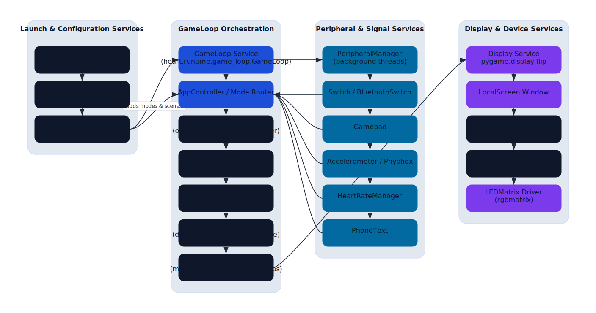

# Heart

Heart powers an interactive LED totem used at events, dance floors, and art
installations. The project combines a pygame-based runtime, a library of animated
scenes, and hardware integrations for sensors, heart-rate monitors, and Bluetooth
controllers. The v0.2 release consolidates tooling under a modern Typer CLI,
ships a refreshed renderer playlist, and documents the full deployment workflow
for both laptops and Raspberry Pi installations.



## Feature highlights

- **Modular renderer ecosystem** – dozens of animations, sprite loops, and text
  overlays live under `heart.display.renderers` and can be composed into custom
  playlists.
- **Event-ready configurations** – the dynamic configuration registry lets you
  switch between curated playlists (for example `lib_2025`) or run custom shows
  created for a specific venue.
- **Hardware-aware runtime** – peripherals such as Bluetooth gamepads, ANT+
  heart-rate monitors, and accelerometers feed real-time data into scenes.
- **First-class debugging tools** – the `totem_debug` CLI merges every hardware
  helper into a single Typer application so field technicians can diagnose
  devices quickly.
- **Flexible deployment targets** – run locally on macOS/Linux for development or
  push frames to an RGB LED matrix driven by a Raspberry Pi.

## Quick start

1. Create and activate a Python 3.11+ virtual environment.
1. Install dependencies and tooling:
   ```bash
   make install
   ```
1. Launch the default playlist in a window:
   ```bash
   totem run --configuration lib_2025
   ```
1. Explore the [`docs/getting_started.md`](docs/getting_started.md) guide for Pi
   deployment, hardware wiring, and advanced CLI flags.

## Command-line interface

The project installs two Typer applications via console scripts:

| Command | Description |
| --- | --- |
| `totem` | Runs the runtime (`totem run`), benchmarks devices, and flashes firmware (`totem update-driver`). |
| `totem_debug` | Groups hardware debugging helpers, including Bluetooth gamepad utilities, UART sniffers, and accelerometer readers. |

Key `totem run` flags:

- `--configuration <name>` – selects a configuration module from
  `heart.programs.configurations`. Use `lib_2025` for the flagship playlist or
  author your own (see [Program configuration guide](docs/program_configuration.md)).
- `--x11-forward` – forces a pygame window even when `HEART_USE_ISOLATED_RENDERER`
  is set, making remote debugging over SSH+XQuartz possible.
- `--add-low-power-mode/--no-add-low-power-mode` – toggles the standby mode that
  keeps the LEDs dim when no primary scenes are active.

Run `totem --help` or `totem_debug --help` for the full command tree.

## Architecture overview

Heart's runtime centers on the `GameLoop` defined in
[`heart/environment.py`](src/heart/environment.py). The loop pulls configuration
from the registry, manages renderer playlists through the `AppController`, and
streams frames to the active `Device` implementation. The supporting documents
provide deeper dives:

- [`docs/runtime_overview.md`](docs/runtime_overview.md) – textual explanation of
  the runtime, renderer stack, and peripheral workers.
- [`docs/code_flow.md`](docs/code_flow.md) – mermaid diagram showing the launch
  sequence, background threads, and display pipeline.
- [`docs/program_configuration.md`](docs/program_configuration.md) – building
  custom playlists and accessing sensor data inside scenes.

## Hardware and peripherals

- **Display devices** – `LocalScreen` renders to a pygame window. `LEDMatrix`
  writes frames to an RGB matrix using the `rgbmatrix` bindings when
  `HEART_USE_ISOLATED_RENDERER=1`.
- **Peripheral manager** – `heart.peripheral.core.manager.PeripheralManager`
  spawns threads for Bluetooth switches, gamepads, accelerometers, and heart-rate
  monitors. Renderers can consume readings via helper modules such as
  `heart.peripheral.heart_rates`.
- **Firmware updates** – device-specific flashers live under `drivers/`. Invoke
  them with `totem update-driver --name <driver>`.
- **Debug CLI** – `docs/hardware_debug_cli.md` documents the consolidated
  diagnostics, including UART sniffers and Bluetooth pairing helpers.

## Development workflow

- `make install` – install the package and development extras using `uv`.
- `make format` – apply Ruff fixes, isort, Black, docformatter, and mdformat to
  the source tree and documentation (run before committing).
- `make test` – execute the pytest suite in parallel.
- `make check` – optional lint/format verification without applying fixes.

We recommend using `uv` for dependency management because it provides reproducible
lock files (`uv.lock`) and fast resolver performance.

## Repository layout

```
heart/
├── docs/                     # Architecture guides, dev logs, hardware notes
├── drivers/                  # Firmware flashing utilities
├── experimental/             # Prototypes (MQTT sidecar, broker helpers)
├── src/heart/                # Runtime, renderers, peripherals, utilities
├── tests/                    # Pytest suite
├── Makefile                  # Common developer tasks
└── pyproject.toml            # Packaging metadata and tool configuration
```

Explore the `docs/devlog/` directory for chronological field notes on hardware
bring-up, auto-boot flows, and rendering experiments.

## Contributing

1. Fork the repository and create a topic branch.
1. Run `make format` and `make test` before pushing changes.
1. Update documentation whenever you add new renderers, configuration modules, or
   hardware capabilities. Major architecture changes should include updated
   diagrams via `scripts/render_code_flow.py`.

Issues and pull requests are welcome! Share videos or photos of your installations
in the issue tracker so others can learn from your setup.
