# Runtime Code Flow

## Problem Statement

Describe how a `totem run` execution traverses configuration services, the runtime loop, peripheral handlers, and display hardware so that engineers can audit the control flow and identify integration boundaries.

## Materials

- Local checkout of this repository.
- Python environment with the dependencies listed in `pyproject.toml` installed.
- Access to `scripts/render_code_flow.py` and the diagram source in this document.

## Technical Approach

Represent each execution stage as a node in a Mermaid flowchart. Colour code orchestration components, service layers, inputs, and outputs so reviewers can trace transitions. The diagram captures call sequencing between the CLI, configuration registry, runtime loop, app routing, peripheral managers, and display drivers. The goal is to surface every point where the runtime crosses a service boundary or hardware interface.

## Flow Diagram

```mermaid
flowchart LR
    %% Visual classes for different service categories
    classDef orchestrator fill:#1d4ed8,stroke:#1d4ed8,color:#f8fafc,stroke-width:2px;
    classDef service fill:#0f172a,stroke:#0f172a,color:#f8fafc;
    classDef input fill:#0369a1,stroke:#0369a1,color:#f8fafc;
    classDef output fill:#7c3aed,stroke:#7c3aed,color:#f8fafc;

    subgraph Launch["Launch & Configuration Services"]
        direction TB
        CLI["CLI (Typer `totem run`)"]
        Registry["Configuration Registry"]
        Configurer["Program Configuration\n`configure(loop)`"]
    end

    subgraph Runtime["GameLoop Orchestration"]
        direction TB
        Loop["GameLoop Service\n(start + main loop)"]
        AppRouter["AppController / Mode Router"]
        Providers["State Providers\n(timer + peripheral streams)"]
        RendererState["Renderer State Streams"]
        ModeServices["Mode Services & Renderers"]
        FrameComposer["Frame Composer\n(surface merge + timing)"]
    end

    subgraph Inputs["Peripheral & Signal Services"]
        direction TB
        PeripheralMgr["PeripheralManager\n(background threads)"]
        Switch["Switch / BluetoothSwitch"]
        Gamepad["Gamepad"]
        Sensors["Accelerometer / Phyphox"]
        HeartRate["HeartRateManager"]
        PhoneText["PhoneText"]
    end

    subgraph Outputs["Display & Device Services"]
        direction TB
        DisplaySvc["Display Service\npygame.display.flip"]
        LocalScreen["LocalScreen Window"]
        Capture["Frame Capture\n(share surface)"]
        DeviceBridge["Device Bridge"]
        LedMatrix["LEDMatrix Driver\n(rgbmatrix)"]
        AverageMirror["AverageColorLED Peripheral"]
        SingleLED["Single LED Device"]
    end

    CLI --> Registry --> Configurer --> Loop
    Configurer --> AppRouter
    Loop --> AppRouter
    Loop --> FrameComposer
    AppRouter --> Providers --> RendererState --> ModeServices --> FrameComposer --> DisplaySvc
    DisplaySvc --> LocalScreen
    DisplaySvc --> Capture --> DeviceBridge --> LedMatrix
    Capture --> AverageMirror --> SingleLED

    Loop --> PeripheralMgr
    PeripheralMgr --> Switch --> AppRouter
    PeripheralMgr --> Gamepad --> AppRouter
    PeripheralMgr --> Sensors --> AppRouter
    PeripheralMgr --> HeartRate --> AppRouter
    PeripheralMgr --> PhoneText --> AppRouter
    PeripheralMgr --> Providers

    class CLI,Registry,Configurer,ModeServices,FrameComposer service;
    class Loop,AppRouter orchestrator;
    class PeripheralMgr,Switch,Gamepad,Sensors,HeartRate,PhoneText input;
    class DisplaySvc,LocalScreen,Capture,DeviceBridge,LedMatrix,AverageMirror,SingleLED output;
```



State providers now sit between the peripheral feeds and mode renderers, translating device inputs and timers into immutable
state snapshots before any pixels are drawn. Renderers operate purely on those state objects, which keeps peripheral handling
and shader logic decoupled while still allowing the game loop to orchestrate timing.

## Rendering Procedure

Whenever the runtime architecture changes, regenerate the SVG with the helper script:

```bash
python scripts/render_code_flow.py --output docs/code_flow.svg
```

`render_code_flow.py` parses the Mermaid definition in this document and emits `docs/code_flow.svg` with consistent styling. The implementation avoids the Mermaid CLI to keep the output reproducible across development environments.
