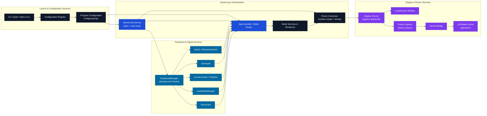

# Runtime Code Flow

The diagram below summarizes how a `totem run` invocation moves through the CLI, runtime loop, peripherals, and display devices. It highlights where the system crosses service boundaries such as hardware peripherals and external LED drivers.



## Rendering the diagram

Run `scripts/render_code_flow.py` to regenerate the SVG using the service layout encoded in this repository whenever the architecture changes:

```bash
python scripts/render_code_flow.py --output docs/code_flow.svg
```

The renderer no longer relies on the mermaid CLI; it generates the SVG directly so that styling stays consistent across environments.
