# Runtime Code Flow

## Problem Statement

Describe how a `totem run` execution traverses configuration services, the runtime loop, peripheral handlers, and display hardware so that engineers can audit the control flow and identify integration boundaries.

## Materials

- Local checkout of this repository.
- Python environment with the dependencies listed in `pyproject.toml` installed.
- Access to `scripts/render_code_flow.py` and the diagram source in this document.

## Technical Approach

Represent each execution stage as a node in a Mermaid flowchart. Colour code orchestration components, service layers, inputs, and outputs so reviewers can trace transitions. The diagram captures call sequencing between the CLI, configuration registry, runtime loop, app routing, peripheral managers, and display drivers. The goal is to surface every point where the runtime crosses a service boundary or hardware interface. Frame composition is split between surface preparation (display-mode coordination and caching) and composition management (merge-strategy selection plus parallel merge coordination). The runtime loop calls an event pump to drain pygame events and manage shutdown or joystick resets.

## Flow Diagram

```mermaid
flowchart LR
    %% Visual classes for different service categories
    classDef orchestrator fill:#1d4ed8,stroke:#1d4ed8,color:#f8fafc,stroke-width:2px;
    classDef service fill:#0f172a,stroke:#0f172a,color:#f8fafc;
    classDef input fill:#0369a1,stroke:#0369a1,color:#f8fafc;
    classDef output fill:#7c3aed,stroke:#7c3aed,color:#f8fafc;

    subgraph Launch["Launch & Configuration Services"]
        direction TB
        CLI["CLI (Typer `totem run`)"]
        Registry["Configuration Registry"]
        Configurer["Program Configuration\n`configure(loop)`"]
    end

    subgraph Runtime["GameLoop Orchestration"]
        direction TB
        Loop["GameLoop Service\n(heart.runtime.game_loop.GameLoop)"]
        AppRouter["AppController / Mode Router"]
        EventPump["Event Pump\n(pygame.event.get)"]
        ModeServices["Mode Services & Renderers"]
        RenderPipeline["Render Pipeline"]
        SurfaceProvider["Surface Provider\n(display mode + surface cache)"]
        CompositionManager["Composition Manager\n(merge strategy + parallel loops)"]
    end

    subgraph Inputs["Peripheral & Signal Services"]
        direction TB
        PeripheralMgr["PeripheralManager\n(background threads)"]
        RxScheduler["Reactivex Thread Pool\n(shared scheduler)"]
        Switch["Switch / BluetoothSwitch"]
        Gamepad["Gamepad"]
        Sensors["Accelerometer / Phyphox"]
        HeartRate["HeartRateManager"]
        PhoneText["PhoneText"]
    end

    subgraph Outputs["Display & Device Services"]
        direction TB
        DisplaySvc["Display Service\npygame.display.flip"]
        LocalScreen["LocalScreen Window"]
        Capture["Frame Capture\n(share surface)"]
        DeviceBridge["Device Bridge"]
        LedMatrix["LEDMatrix Driver\n(rgbmatrix)"]
        AverageMirror["AverageColorLED Peripheral"]
        SingleLED["Single LED Device"]
    end

    CLI --> Registry --> Configurer --> Loop
    Configurer --> AppRouter
    Loop --> AppRouter
    Loop --> EventPump
    Loop --> RenderPipeline
    AppRouter --> ModeServices --> RenderPipeline --> CompositionManager --> DisplaySvc
    RenderPipeline --> SurfaceProvider
    DisplaySvc --> LocalScreen
    DisplaySvc --> Capture --> DeviceBridge --> LedMatrix
    Capture --> AverageMirror --> SingleLED

    Loop --> PeripheralMgr --> RxScheduler
    RxScheduler --> Switch --> AppRouter
    RxScheduler --> Gamepad --> AppRouter
    RxScheduler --> Sensors --> AppRouter
    RxScheduler --> HeartRate --> AppRouter
    RxScheduler --> PhoneText --> AppRouter

    class CLI,Registry,Configurer,ModeServices,RenderPipeline,SurfaceProvider,CompositionManager,EventPump service;
    class Loop,AppRouter orchestrator;
    class PeripheralMgr,RxScheduler,Switch,Gamepad,Sensors,HeartRate,PhoneText input;
    class DisplaySvc,LocalScreen,Capture,DeviceBridge,LedMatrix,AverageMirror,SingleLED output;
```



## Rendering Procedure

Whenever the runtime architecture changes, regenerate the SVG with the helper script:

```bash
python scripts/render_code_flow.py --output docs/code_flow.svg
```

`render_code_flow.py` parses the Mermaid definition in this document and emits `docs/code_flow.svg` with consistent styling. The implementation avoids the Mermaid CLI to keep the output reproducible across development environments.
