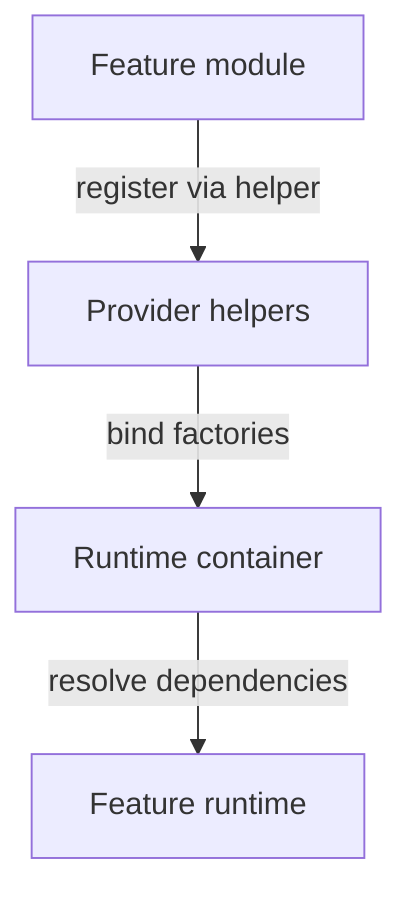

# Lagom deep integration plan

## Problem Statement

The codebase uses Lagom for dependency injection in a few locations, but container creation and provider registration are not consistently centralized. Some feature modules still instantiate or reference Lagom types directly, which makes lifecycle management harder and spreads knowledge of the DI framework across the codebase. We need a plan to deepen Lagom integration so the runtime container is built in one place, provider registration is standardized, and feature modules depend on `heart.runtime.container.RuntimeContainer` rather than Lagom internals.

## Materials

- **Hardware:** development workstation with access to the Heart repository.
- **Software:** Python environment managed via `uv`, `make`, and the tooling in `pyproject.toml`.
- **Data:** existing runtime configuration and DI registrations in `src/heart/runtime/container.py` and `src/heart/peripheral/core/providers.py`.
- **References:** `docs/code_flow.md`, `scripts/render_code_flow.py`, and current tests under `tests/`.

## Opening abstract

This plan consolidates Lagom usage behind the runtime container and provider helper APIs. It replaces scattered container instantiation with `build_runtime_container`, ensures provider factories are named module-level callables, and introduces a registry that tracks runtime containers through weak references for safe updates. The outcome is a predictable DI lifecycle, fewer direct Lagom imports, and easier testing via consistent provider registration paths.

## Success criteria table

| Target behaviour | Validation signal | Owner |
| --- | --- | --- |
| All container creation flows through `heart.runtime.container.build_runtime_container` | `rg "Container\(" src/` shows no new Lagom container instantiations in feature modules | Runtime maintainers |
| Feature modules avoid direct Lagom imports | `rg "lagom" src/` only matches `heart/runtime/container.py` and `heart/peripheral/core/providers.py` | Runtime maintainers |
| Provider registration uses helper functions and named factories | Provider helpers cover singleton and transient bindings with named callables | Peripheral maintainers |
| Runtime container tracking uses weak references | `weakref.WeakSet` used to track registered containers; no strong references retained | Runtime maintainers |
| Tests validate container wiring and provider resolution | `make test` passes and new DI tests cover registration paths | QA / Runtime maintainers |

## Task breakdown checklists

### Discovery

- [ ] Inventory current Lagom usage with `rg "lagom" src/` and map each usage to a module owner.
- [ ] Identify any feature modules instantiating containers or using Lagom bindings directly.
- [ ] Review provider helper coverage in `src/heart/peripheral/core/providers.py` for gaps (singleton, factory, eager).
- [ ] Note runtime container entry points in `src/heart/runtime/container.py` and any alternative constructors.

### Implementation

- [ ] Add or extend provider helper functions so all binding patterns used in feature modules are covered.
- [ ] Replace direct Lagom imports in feature modules with `RuntimeContainer` references and provider helpers.
- [ ] Define provider factories as named module-level callables with clear names for tracing in logs.
- [ ] Implement a weak-reference registry for runtime containers to support provider updates without leaks.
- [ ] Update runtime container build flow to register core providers consistently and log registration order via `heart.utilities.logging.get_logger`.
- [ ] Ensure background threads started by providers are named.

### Documentation

- [ ] Update `docs/code_flow.md` to describe the centralized container and provider registration flow.
- [ ] Run `scripts/render_code_flow.py` to refresh the diagram.
- [ ] Add a research note under `docs/research/` describing integration impacts and referencing key modules.
- [ ] Add a short migration note for contributors in `docs/planning/README.md` or a new appendix under the plan.

### Validation

- [ ] Add tests under `tests/` that verify provider registration flows through helpers and resolves via `RuntimeContainer`.
- [ ] Ensure all tests include docstrings that describe behaviour and why it matters.
- [ ] Run `make test` and capture results.
- [ ] Run `make format` before final commit.

## Narrative walkthrough

The Discovery phase locates all current Lagom usage to prevent partial migrations and defines the scope of provider helper coverage. This phase creates a map of which feature modules need to be updated and whether the helper APIs already support the binding patterns they use. It also establishes baseline references for future diffs.

Implementation begins with expanding provider helpers in `heart.peripheral.core.providers` so they can represent the full set of binding needs, keeping Lagom types isolated. Feature modules then shift to these helpers and refer to `RuntimeContainer` instead of Lagom `Container` types. A weak-reference registry tracks which runtime containers are active, enabling provider updates without retaining containers after shutdown. Logging is added through `get_logger(__name__)` to trace registration order and lifecycle hooks.

Documentation updates follow immediately after implementation, reflecting the new centralized runtime container workflow in `docs/code_flow.md` and a refreshed diagram. A research note captures the rationale and highlights design trade-offs for future changes. This sequencing ensures the documentation matches the implementation while context is still fresh.

Validation focuses on tests that assert provider registration is done through helper APIs and that container resolution behaves predictably. These tests enforce the architectural boundary between feature modules and Lagom. The plan ends by running the formatting and test suites to keep the repository compliant with tooling requirements.

## Visual reference

| Layer | Responsibility | Key modules |
| --- | --- | --- |
| Runtime container | Build and own DI container; register core providers | `src/heart/runtime/container.py` |
| Provider helpers | Encapsulate Lagom bindings and registration patterns | `src/heart/peripheral/core/providers.py` |
| Feature modules | Declare dependencies via helper registration; avoid Lagom imports | `src/heart/peripheral/**` |

## Risk analysis

| Risk | Probability | Impact | Mitigation | Early warning signal |
| --- | --- | --- | --- | --- |
| Hidden Lagom imports remain in feature modules | Medium | Medium | Use `rg "lagom" src/` in CI and update module imports | CI or review discovers new Lagom types outside target modules |
| Provider helper APIs are incomplete | Medium | High | Expand helpers before migrating modules; add tests for new patterns | Feature module migration blocked by missing helper functionality |
| Weak reference registry introduces ordering issues | Low | Medium | Add logging for registration order; ensure deterministic updates | Non-deterministic test failures or missing providers |
| Documentation diverges from implementation | Medium | Medium | Update docs immediately after code changes; run diagram renderer | Code review notes outdated docs |
| Runtime container changes break tests | Medium | Medium | Add focused tests for new DI flows; run `make test` early | Test failures during initial migration |

**Mitigation checklist**

- [ ] Add a CI or pre-commit check to flag new Lagom imports outside target modules.
- [ ] Write tests for each helper registration pattern before migrating feature modules.
- [ ] Log provider registration order at debug level to diagnose missing bindings.
- [ ] Update documentation in the same pull request as code changes.

## Outcome snapshot

After completion, Lagom is encapsulated in `heart.runtime.container` and `heart.peripheral.core.providers`, with feature modules only interacting through `RuntimeContainer` and helper APIs. Runtime container creation is consistent across entry points, provider factories are named and discoverable, and container tracking does not leak instances. Documentation and diagrams describe the centralized DI flow, and the test suite verifies registration and resolution paths.
