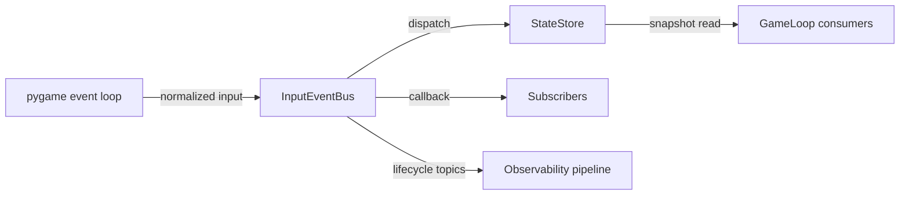

# Input Event Bus & State Store Plan

## Problem Statement

Replace the ad-hoc peripheral state mutations in the game loop with a structured event bus and shared state store so systems can subscribe to input changes and read deterministic snapshots. The rotary switch family (USB and Bluetooth) and the gamepad already emit normalized events via `heart.peripheral.core.event_bus`, giving us the reference implementation for the remaining peripherals.

## Materials

- Existing `GameLoop` implementation and peripheral modules under `src/heart/peripheral`.
- Proposed bus implementation in `src/heart/events`.
- Access to hardware peripherals (switches, Bluetooth controllers, gamepads) for validation.
- Test harness capable of simulating pygame events.

## Opening Abstract

Today, peripherals mutate module-level state and the `GameLoop` drains pygame events directly. This makes it difficult to trace state changes, support multiple devices, or replay inputs. The goal is to introduce an in-process event bus coupled with a state store. Peripherals publish typed events, subscribers react synchronously, and consumers query the latest snapshots through a simple API. The migration must maintain backwards compatibility while we transition each device. The switch and gamepad integrations already run behind the `ENABLE_INPUT_EVENT_BUS` flag with targeted coverage in `tests/peripheral/test_switch_event_bus.py` and `tests/peripheral/test_gamepad_event_bus.py`, demonstrating the pattern future migrations should follow.

### Why Now

Upcoming multi-device installations require deterministic arbitration between inputs, and the MQTT split plan depends on structured events. Establishing the bus now simplifies both efforts.

## Success Criteria

| Behaviour | Signal | Owner | Status |
| --- | --- | --- | --- |
| Event bus delivers typed payloads for core peripherals | Unit tests show `switch.pressed` and `gamepad.moved` events emitted with timestamps | Peripheral lead | ✅ Exercised in `tests/peripheral/test_switch_event_bus.py` and `tests/peripheral/test_gamepad_event_bus.py` |
| State store exposes latest snapshots with aggregation | `StateStore.get_latest()` returns coherent values during integration tests | Runtime engineer | 🚧 Need end-to-end read path assertions from `GameLoop` consumers |
| Migration preserves existing scene behaviour | Regression suite passes with bus enabled and legacy code removed | QA owner | ⚠️ Pending once the game loop consumes bus snapshots exclusively |

## Task Breakdown Checklists

### Discovery

- [x] Document current peripheral state mutations and identify consumers across `src/heart/peripheral` and `src/heart/environment.py`.
- [x] Define canonical event types, producer IDs, and payload schemas for switch and gamepad paths.
- [x] Assess lifecycle requirements (connect, disconnect, heartbeat) for the remaining peripherals (phone text, microphone, heart rate).
- [x] Map telemetry requirements so lifecycle and input events feed `src/heart/observability/metrics.py` consistently.
- [ ] Capture hardware-specific debounce and smoothing rules before translating them into aggregation strategies.

### Implementation – Core Infrastructure

- [x] Implement `InputEventBus` with `subscribe`, `unsubscribe`, decorator support, and synchronous dispatch.
- [x] Introduce `StateStore` with aggregation strategies (`overwrite`, `sum`, `sequence`).
- [x] Land shared `InputEvent` protocol and typed payload helpers in `src/heart/events/types.py` with exhaustive docstrings.
- [x] Publish developer guide under `docs/api/input_bus.md` covering producer registration, lifecycle events, and snapshot reads.
- [x] Expose bus-driven snapshots to the game loop (`src/heart/environment.py`) so renderers retire module-level globals in favour of `StateStore` queries.
- [x] Add structured logging hooks inside `InputEventBus.emit()` to trace dispatch latency and dropped handlers.

### Implementation – Peripheral Migration

- [x] Wrap switch, Bluetooth switch, and gamepad integrations to emit events while preserving existing behaviour.
- [x] Register producers with lifecycle hooks (connected, suspected_disconnect, recovered, disconnected) for switch and gamepad paths.
- [x] Add feature flag (`ENABLE_INPUT_EVENT_BUS`) for staged rollout and propagation control in `PeripheralManager`.
- [x] Migrate heart rate monitor under `src/heart/peripheral/heart_rate.py` with structured payloads for bpm, confidence, and device ID.
- [x] Move accelerometer handling to event producers inside `src/heart/peripheral/accelerometer.py`, ensuring axis aggregation honours smoothing rules.
- [x] Convert phone text ingestion (`src/heart/peripheral/phone.py`) into async-safe producers emitting lifecycle and message events.
- [x] Shift microphone amplitude detection (`src/heart/peripheral/microphone.py`) to streaming events with rolling RMS snapshots.
- [ ] Remove legacy switch state plumbing in legacy `SwitchSubscriber` consumers once verification completes.
- [x] Backfill regression fixtures in `tests/peripheral/` for each migrated peripheral with representative payloads.

### Validation

- [x] Build integration tests simulating pygame events and asserting bus emissions plus state updates for switch and gamepad peripherals.
- [ ] Exercise multi-device arbitration scenarios to verify aggregation policies (dual Bluetooth switches, mixed controllers).
- [ ] Capture logs demonstrating lifecycle events during hardware connect/disconnect.
- [ ] Run full-scene smoke tests with `ENABLE_INPUT_EVENT_BUS=True` to confirm behavioural parity.
- [ ] Add soak test capturing 15-minute dispatch traces with profiling hooks enabled.

## Narrative Walkthrough

Discovery clarified the global state touch points inside `src/heart/peripheral` and `src/heart/environment.py`, producing an event taxonomy and producer ID strategy that already drives the switch and gamepad emitters. We now need to finish the lifecycle audit for microphone, heart-rate, and phone text peripherals so lifecycle handlers converge on a common set of events before we widen the rollout. Core infrastructure delivered the bus, state store, and lifecycle helpers; closing work there focuses on introducing typed payload helpers, structured logging, and an authoring guide that teaches new contributors how to emit deterministic events. Implementation now shifts toward exposing bus-derived snapshots to the game loop and migrating the remaining devices, deleting the legacy switch plumbing once parity is proven. Validation culminates in multi-device simulations, log capture from hardware connect/disconnect cycles, long-running soak tests, and smoke tests with the feature flag enabled to demonstrate end-to-end equivalence while surfacing any regression quickly.

## Visual Reference

| Flow Stage | Description | Artifact |
| --- | --- | --- |
| Pygame event intake | `GameLoop` drains events and emits typed bus events | `InputEventBus.emit()` |
| Peripheral normalization | Switch and gamepad translate hardware payloads into typed `Input` instances | `src/heart/peripheral/switch.py`, `src/heart/peripheral/gamepad/gamepad.py` |
| State update | `StateStore.update()` records latest payload and aggregate | `StateStore` snapshot |
| Subscriber reaction | Systems consume events synchronously | Navigation controllers, mode handlers |
| Lifecycle signalling | Peripherals broadcast availability transitions for observability | Bus entries under `*.lifecycle` |

## Risk Analysis

| Risk | Probability | Impact | Mitigation | Early Warning |
| --- | --- | --- | --- | --- |
| Synchronous bus introduces latency spikes | Medium | Medium | Keep handlers lightweight, consider background dispatch for heavy consumers | Frame timing logs show increased jitter |
| Aggregation rules fail for edge cases | Medium | High | Document policies, add regression tests per event type | Snapshot diffs show inconsistent values |
| Feature flag rollback incomplete | Low | High | Maintain legacy path until regression suite passes without it | Legacy toggle required after rollout |
| Lifecycle semantics diverge across peripherals | Medium | Medium | Catalogue lifecycle requirements and align helper APIs before migration | Mixed payload formats or missing recovery events |

### Mitigation Tasks

- [ ] Profile dispatch time and identify handlers requiring async offloading.
- [ ] Create aggregation registry with test fixtures per mode.
- [ ] Automate feature-flag toggles in CI to ensure both paths execute.
- [ ] Draft lifecycle conformance checklist covering peripherals slated for migration.

### Refactor & Cleanup Roadmap

- [ ] Delete per-module global state caches once all consumers read from `StateStore` snapshots.
- [ ] Collapse duplicate lifecycle enums into a single definition within `src/heart/events/lifecycle.py`.
- [ ] Introduce dependency injection hooks in `GameLoop` to simplify unit testing without pygame.
- [ ] Migrate integration tests to use the shared `BusTestHarness` fixture and remove bespoke mocks.
- [ ] Document rollback procedure for `ENABLE_INPUT_EVENT_BUS` in `docs/operations/runbook.md`.

## Outcome Snapshot

Peripherals publish structured events through a shared bus, the state store exposes deterministic snapshots, and scenes rely on the new API without manual state plumbing. The switch and gamepad already emit lifecycle and interaction events through the bus; once the remaining peripherals migrate and the game loop consumes bus snapshots directly, operators can reason about availability from lifecycle topics and remote input pipelines can reuse the same contracts.
