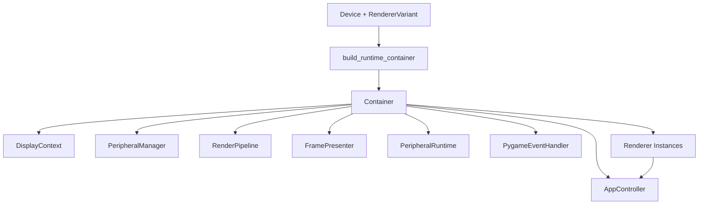

# Lagom Deep Integration

## Problem Statement

The current codebase uses Lagom only in a few isolated places, leaving many runtime components wired together manually. This ad-hoc wiring creates duplicated construction logic, makes it harder to swap implementations in tests, and scatters lifecycle ownership across modules such as `src/heart/runtime/game_loop_components.py` and `src/heart/navigation/composed_renderer.py`. A deeper Lagom integration is needed so that dependency wiring, lifecycle control, and per-mode composition are consistent and traceable across the runtime, peripheral, and rendering layers.

## Materials

- Python 3.11 runtime with `uv` for dependency management.
- Existing Lagom dependency (`lagom` in `pyproject.toml`).
- Access to the Heart runtime modules (e.g., `src/heart/runtime/`, `src/heart/navigation/`, `src/heart/peripheral/`).
- Access to the Lagom container entry points (`src/heart/runtime/container.py`, `src/heart/peripheral/core/providers/`).
- A development environment that can run `make format` and `make test`.
- Optional hardware peripherals for validating `PeripheralManager` integration and event streams.

## Opening Abstract

This plan proposes consolidating runtime dependency wiring into a single Lagom container that is explicitly built and passed through the runtime. The goal is to move manual construction logic out of `GameLoop` and related modules, register key singletons in the container, and expose container-backed factories for renderers, peripheral providers, and runtime services. By aligning the construction of `DisplayContext`, `RenderPipeline`, `PeripheralRuntime`, and `AppController` around Lagom, the runtime becomes easier to test, easier to extend, and less prone to drift when new components are added.

## Success Criteria

| Target Behaviour | Validation Signal | Owner |
| --- | --- | --- |
| Runtime components are resolved via Lagom container and not manually constructed in `GameLoop` | `build_game_loop_components` uses container factories for `DisplayContext`, `RenderPipeline`, and `PeripheralRuntime` | Runtime owner |
| Peripheral provider registry uses container-scoped bindings | Container module exposes registration for `PeripheralManager` and providers | Peripheral owner |
| Renderers can be resolved through container with explicit scopes | `ComposedRenderer.resolve_renderer` uses shared container API and tests cover container binding | Rendering owner |
| Container configuration is centralized | New module (e.g., `src/heart/runtime/container.py`) defines container construction and registration | Runtime owner |
| Tests can swap implementations via container overrides | Unit tests use Lagom `Container` overrides without changing runtime modules | Test owner |
| Lagom imports stay centralized | Lagom types are only imported in `src/heart/runtime/container.py` and `src/heart/peripheral/core/providers/` | Runtime owner |

## Task Breakdown Checklists

### Discovery

- [ ] Inventory all manual construction sites (start at `src/heart/runtime/game_loop_components.py`, `src/heart/navigation/composed_renderer.py`, and `src/heart/peripheral/core/providers/__init__.py`).
- [ ] Identify runtime modules that should be registered as singletons (e.g., `PeripheralManager`, `DisplayContext`, `RenderPipeline`).
- [ ] Decide on container ownership boundaries (global container vs. per-game-loop container) and document in the plan.
- [ ] Verify where `Device` is instantiated and decide how it should flow into container configuration.

### Implementation

- [ ] Create a dedicated container builder module (e.g., `src/heart/runtime/container.py`) that exposes `build_runtime_container(device: Device, render_variant: RendererVariant) -> RuntimeContainer`.
- [ ] Register `PeripheralManager`, `DisplayContext`, `RenderPipeline`, `FramePresenter`, `PeripheralRuntime`, `PygameEventHandler`, and `AppController` in the container builder, using named provider callables and `register_singleton_provider` helpers.
- [ ] Refactor `build_game_loop_components` to resolve all components from the container rather than constructing them inline.
- [ ] Update `GameLoop` to accept a container created by the builder module and remove ad-hoc instantiation.
- [ ] Align `ComposedRenderer.resolve_renderer` with the shared container instance so renderers can share registered services.
- [ ] Update the provider registry to register against the runtime container instead of holding a module-level `Container()` instance.
- [ ] Replace feature-module imports of Lagom types with references to `RuntimeContainer` so wiring remains centralized.
- [ ] Update standalone renderer scripts (for example, `src/heart/renderers/mandelbrot/scene.py`) to resolve `PeripheralManager` through the runtime container instead of direct instantiation.
- [ ] Ensure configuration and overrides for tests are documented and demonstrate the pattern in a new test module.

### Validation

- [ ] Add tests that confirm container overrides for `PeripheralManager` and `RenderPipeline` are respected.
- [ ] Add a test to confirm `GameLoop` uses container-resolved components instead of manual construction.
- [ ] Run `make test` and confirm existing tests pass.

## Narrative Walkthrough

The plan begins with a discovery pass to map where dependencies are constructed and identify which classes should be singletons. This is essential because the runtime currently constructs components directly in `build_game_loop_components` and holds a separate container in `peripheral/core/providers/__init__.py`, leading to ambiguous ownership.

Implementation starts by introducing a single container builder module. The builder becomes the canonical entry point for wiring a runtime container with a specific `Device` and `RendererVariant`. It registers core singletons and uses Lagom providers for classes that need the device or render variant injected. Once this module exists, `build_game_loop_components` can shrink to simply resolve components from the container, and `GameLoop` becomes a thin orchestrator rather than a constructor. Renderer composition also shifts to container-backed resolution, so `ComposedRenderer.resolve_renderer` shares the same container state as the rest of the runtime.

Validation focuses on new tests that verify overrides. If a test swaps `PeripheralManager` with a stub in the container, the runtime should use that stub everywhere. This guards against hidden construction that bypasses the container. Validation also ensures that the module-level container currently in the peripheral providers package is removed or isolated so there is a single authoritative container.

## Visual Reference

## Risk Analysis

| Risk | Probability | Impact | Mitigation | Early Warning Signal |
| --- | --- | --- | --- | --- |
| Multiple containers remain in use leading to split lifecycles | Medium | High | Remove the global container in `peripheral/core/providers/__init__.py` and centralize container ownership | Instances of `Container()` outside the builder module remain |
| Lagom imports leak into feature modules | Medium | Medium | Enforce `RuntimeContainer` usage and register providers through `heart.peripheral.core.providers` helpers | New Lagom imports appear outside the container and provider modules |
| Components require runtime state not easily provided by Lagom | Medium | Medium | Use provider functions with explicit arguments and register `Device` as a singleton value | New constructors added in `game_loop_components` to pass state manually |
| Renderer resolution breaks due to missing registrations | Low | Medium | Add container registration tests for renderer factories and document registration patterns | Runtime error resolving renderer types in `ComposedRenderer.resolve_renderer` |
| Tests become brittle due to container state leakage | Medium | Medium | Provide factory helpers to create isolated containers for tests | Tests depend on global container state |

### Mitigation Checklist

- [ ] Audit the repository for any `Container()` instantiations after the refactor and consolidate them.
- [ ] Add container builder docstrings with examples of overrides for tests.
- [ ] Ensure container scopes are recreated per `GameLoop` instance to avoid shared state leakage.

## Outcome Snapshot

After the integration, a developer can build a runtime container from `src/heart/runtime/container.py`, pass it to `GameLoop`, and know that all runtime components, peripherals, and renderers resolve through the same container. `build_game_loop_components` no longer manually constructs components, the peripheral providers no longer define a global container, and tests can override any service by providing a custom container. The runtime wiring becomes consistent, traceable, and easier to validate.
