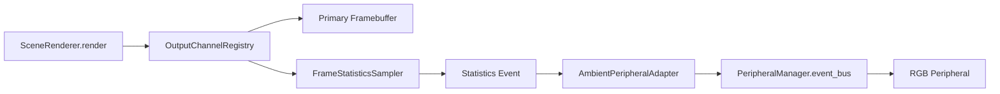

# Problem Statement

The renderer currently targets a single LED matrix or composited display and assumes downstream hardware consumes a pre-mixed frame. That makes it hard to describe effects for auxiliary devices such as ambient light strips or wearable badges because every output expects the same rectangular framebuffer. We need an idiomatic plan for orchestrating multiple output devices so that a peripheral can emit a colour derived from the primary scene, like the average hue of the active screen, without duplicating renderer logic.

# Materials

- Host running the `heart` runtime with access to `src/heart/renderers/` and `src/heart/peripheral/` packages.
- Connected LED matrix (reference display) plus at least one RGB-capable peripheral managed by `heart.peripheral.core.manager.PeripheralManager`.
- Profiling tools in `experimental/` for frame timing and bandwidth verification.
- Access to the event loop in `src/heart/environment.py` and the renderer lifecycle in `src/heart/navigation.py` for integration points.
- mdBook-compatible diagramming tools (Mermaid) for flow documentation.

# Opening Abstract

This plan proposes a renderer abstraction that treats each output device as a first-class sink with its own colour contract, rather than a consumer of a monolithic image. The implementation introduces a post-processing stage that samples the composed screen, computes an average colour, and dispatches a structured payload to any registered ambient peripheral.

We start by defining an `OutputChannel` registry inside `src/heart/renderers/__init__.py`. Renderers submit semantic layers (primary framebuffer, sampled statistics, metadata) to the registry. A dedicated ambient adaptor listens for the statistics layer, calculates per-device colour targets, and forwards them to `PeripheralManager` so that peripherals glow in sync with the display. This removes the "render a big image" assumption and gives each device a focused data stream.

# Success Criteria

| Target Behaviour | Validation Signal | Owner |
| --- | --- | --- |
| Renderer emits a statistics payload with average RGB per frame | Unit tests covering the sampling helper in `tests/display/test_frame_statistics.py` | Display pipeline |
| Peripheral adaptor consumes statistics and updates colour on the event bus | Integration test using a fake peripheral in `tests/peripheral/test_ambient_adapter.py` | Peripheral platform |
| Frame time impact stays below 5% on Raspberry Pi 4 | Benchmark recorded with `scripts/benchmark_render.py` | Runtime engineering |
| Configuration allows mapping statistics to multiple devices with per-device transforms | Config snapshot in `docs/library/tooling_and_configuration.md` update | Developer experience |

# Task Breakdown Checklists

## Discovery

- [ ] Audit `src/heart/navigation.py` to document where renderers are initialised and where to hook the new statistics sink.
- [ ] Catalogue existing peripherals under `src/heart/peripheral/` that already expose RGB controls (e.g., BLE light strips) or require new drivers.
- [ ] Profile the cost of copying the active screen surface using `pygame.surfarray.pixels3d` to estimate sampling overhead.

## Implementation

- [ ] Introduce an `OutputChannel` interface in `src/heart/renderers/__init__.py` with `submit_frame(surface, metadata)` and `submit_statistics(stats)` methods.
- [ ] Implement `FrameStatisticsSampler` in `src/heart/display/color.py` to compute average RGB and luminance.
- [ ] Add a `StatisticsDispatchRenderer` that wraps existing renderers in `src/heart/renderers/multi_scene.py`, capturing post-render hooks.
- [ ] Create `AmbientPeripheralAdapter` in `src/heart/peripheral/core/ambient.py` that subscribes to statistics events and publishes colour updates to peripherals via `PeripheralManager.event_bus`.
- [ ] Extend program configuration to map logical statistics channels to physical peripherals, storing defaults in `src/heart/programs/`.

## Validation

- [ ] Write unit tests for `FrameStatisticsSampler` verifying average colour accuracy with synthetic frames.
- [ ] Build an integration harness in `tests/peripheral/test_ambient_adapter.py` that simulates a peripheral receiving colour updates.
- [ ] Execute `make test` and verify no regressions.
- [ ] Record before/after frame timing with `scripts/benchmark_render.py --renderer ambient_demo` and document results in `docs/devlog/`.

# Narrative Walkthrough

Discovery begins in `src/heart/navigation.py`, where renderers are wired into the game loop alongside `PeripheralManager`. By inserting the `OutputChannel` registry here we avoid leaking peripheral awareness into individual renderers. The registry needs to live at the same abstraction level as `SceneRenderer` so renderers can submit frame surfaces after composition. During this phase we also catalogue candidate peripherals—BLE strips in `src/heart/peripheral/phyphox.py` and custom boards under `src/heart/peripheral/rgb_*`—to understand how they ingest colour data.

Implementation proceeds in layers. First, we define the `OutputChannel` protocol and wire it into the renderer lifecycle. Each frame, the active renderer writes its surface to the primary channel and invokes the statistics sampler. `FrameStatisticsSampler` reads the `pygame.Surface` provided by `SceneRenderer.process` in `src/heart/renderers/__init__.py`, computes average RGB using vectorised NumPy operations, and publishes the result via the registry. Next, `AmbientPeripheralAdapter` listens for statistics events. It lives alongside existing peripheral utilities in `src/heart/peripheral/core/` and exposes methods for mapping a logical statistic stream to a peripheral capability (for example, converting from RGB to HSV for smart bulbs). The adapter pushes updates to the event bus, using the same pattern as `heart.peripheral.microphone.Microphone` when it publishes audio levels.

Configuration ties everything together. We extend the runtime configuration schema so that `heart.environment.EnvironmentConfig` accepts an `ambient_channels` section describing each peripheral target, the statistics stream it consumes, and optional transforms. During environment bootstrapping, `Environment._initialize_peripherals` reads this mapping, instantiates an adapter per entry, and registers them with `PeripheralManager`. Developers can then add a single YAML block to map "screen_average" to a desk light, without modifying renderers.

Validation relies on explicit observability. We add structured events under `src/heart/peripheral/input_payloads.py` to describe ambient updates (`peripheral.ambient.colour`). The adapter emits these events so downstream tooling—like the debugging CLI in `src/heart/x/cli.py`—can introspect the live colour and verify it matches expectations. A lightweight recorder stored in `src/heart/display/recorder.py` captures frame samples alongside statistics so reviewers can replay the session and confirm the derived colour traces align with the visual scene.

Finally, we produce developer tooling to experiment with channel mappings. A new `scripts/ambient_preview.py` command reads the registry output and mirrors the colour in a terminal swatch, mirroring the approach taken by `scripts/render_code_flow.py`. This tightens the edit-test loop for artists who want to tune smoothing parameters or combine multiple statistics (for example, averaging only the top half of the screen for ceiling lights). Packaging these utilities with the plan ensures the workflow remains more expressive than streaming a raw framebuffer.

# Visual Reference

# Risk Analysis

| Risk | Probability | Impact | Mitigation | Early Warning |
| --- | --- | --- | --- | --- |
| Average colour sampling stalls the render thread | Medium | High | Use NumPy arrays with shared memory views and benchmark per frame; fall back to reduced sampling resolution when frame time > 16ms | Frame timing logs from `scripts/benchmark_render.py` exceed baseline |
| Multiple renderers register conflicting statistics identifiers | Medium | Medium | Validate registry keys at registration and enforce namespace prefixes in configuration | Runtime logs report duplicate channel registrations |
| Peripherals with slow update rates tear or lag behind the display | Medium | Medium | Add rate-limiting to `AmbientPeripheralAdapter` and expose smoothing configuration | Observability dashboard shows sustained queue growth on the event bus |
| Adapter publishes colours that exceed peripheral gamut | Low | Medium | Provide colour-space clamping and per-device calibration in configuration | Peripheral firmware rejects updates or clips values |

## Mitigation Checklist

- [ ] Instrument registry operations with structured logs using `heart.utilities.logging` to catch key collisions.
- [ ] Add a sampling window size parameter so developers can trade fidelity for performance.
- [ ] Implement a smoothing filter (exponential moving average) in `AmbientPeripheralAdapter` with unit coverage.
- [ ] Document configuration examples and calibration workflow in `docs/library/tooling_and_configuration.md`.

# Outcome Snapshot

Once implemented, renderers emit both the composed frame and derivative statistics. The ambient adapter consumes these statistics, maps them to configured peripherals, and publishes colour updates without requiring each renderer to understand peripheral protocols. Developers can reference `docs/library/tooling_and_configuration.md` for configuration snippets and can test ambient behaviour using fake peripherals in `tests/peripheral/`.

The runtime exposes a consistent pattern for multi-device outputs: renderers focus on scene composition, statistics modules create data products, and adapters translate those products into peripheral commands. New peripherals can opt into statistics streams by implementing the adapter contract, enabling richer multi-device experiences than pushing a single oversized image.
