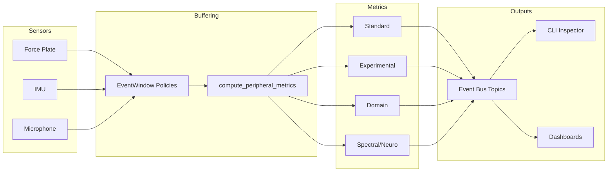

______________________________________________________________________

## title: Peripheral Metrics Integration Plan

# Problem Statement

The current peripheral stack lacks a consolidated metrics subsystem that can
surface core, spectral, and domain-specific statistics for incoming sensor
streams. Without this layer we cannot detect bursts, oscillations, or failure
signatures early enough to drive adaptive behaviours or maintenance alerts. We
need a roadmap that enumerates every required metric, the data prerequisites,
and the validation hooks so implementation can proceed without ambiguity.

# Materials

- Raspberry Pi 4 (8 GB) or equivalent host running the HEART peripheral stack.
- BLE, USB, and analog sensor peripherals capable of emitting time-series
  samples (force plates, microphones, IMUs, rotary encoders).
- Access to the event bus APIs in `heart.peripheral.core.event_bus` and the
  rolling window helpers in `heart.events.metrics`.
- NumPy and SciPy runtime dependencies (already listed in `pyproject.toml`).
- Benchmark capture scripts under `scripts/` to replay recorded sessions.
- Diagram tooling (Mermaid via `mdformat` plugin or Excalidraw export) for
  architecture visuals.

# Opening Abstract

This document defines the phased plan for building a unified peripheral metrics
suite that emits the 20 standard and experimental analytics requested for the
sensor pipeline. The plan sequences infrastructure upgrades (shared buffer,
spectral transforms), implements the metrics in programmable batches, and wires
them into the event bus for downstream consumers. Validation blends synthetic
signal injection, regression snapshots, and performance profiling to guarantee
we can sustain at least 120 Hz sampling without frame drops.

# Success Criteria

| Target Behaviour | Validation Signal | Owner |
|---------------------------------------------------|----------------------------------------------------------------------------|-------|
| Metrics buffers honour window and length policies | Unit tests under `tests/events/test_peripheral_metrics.py` exercise edge | @todo |
|                                                   | windows via `EventWindow` fixtures.                                       |       |
| Standard metrics emitted per update cycle         | Bus captures in `tests/events/test_metrics_bus.py` confirm 10/10 entries.| @todo |
| Spectral features computed within 8 ms budget     | Benchmark harness `pytest -k metrics_benchmark` stays under threshold.   | @todo |
| Domain-specific flags raise actionable alerts     | Integration test uses seeded IMU/log data to trigger Allan variance alert.| @todo |

# Task Breakdown Checklists

## Phase 1 – Infrastructure

- [ ] Expose `compute_peripheral_metrics` in `src/heart/events/metrics.py` so any `EventWindow` can render snapshots.
- [ ] Integrate percentile, histogram, and EWMA helpers leveraging
  `heart.events.metrics.EventWindow` storage.
- [ ] Add serialization schema for publishing snapshots onto the event bus.

## Phase 2 – Standard Metrics

- [ ] Implement event count, EPS, rolling sum/min/max, percentiles, histogram,
  EWMA, inter-event interval stats, and threshold exceedance counters.
- [ ] Validate against synthetic ramp/burst inputs to confirm expected outputs.
- [ ] Document parameter knobs (window length, EWMA alpha, histogram bins).

## Phase 3 – Experimental Metrics

- [ ] Add z-score anomaly scoring, configurable complex event pattern detection,
  zero-lag cross-correlation versus a reference stream, FFT dominant frequency,
  and sample entropy calculators.
- [ ] Provide fallback behaviour when insufficient samples are available.
- [ ] Extend integration tests to cover dual-stream correlation scenarios.

## Phase 4 – Domain Metrics

- [ ] Implement Allan variance, Hurst exponent, crest factor, kurtosis, and
  permutation entropy calculators with validation fixtures sourced from IMU and
  vibration reference datasets.
- [ ] Publish regression notebooks under `docs/research/` demonstrating metrics
  stability on noisy inputs.
- [ ] Create tuning checklist for choosing averaging times and embedding sizes.

## Phase 5 – Spectral & Neuro Metrics

- [ ] Add spectral centroid, flatness, roll-off, spectral entropy, spectral
  kurtosis, envelope spectrum peak, order-tracked amplitudes, TKEO energy, and
  Hjorth parameters.
- [ ] Implement the Fano factor calculation for spike-train style event counts.
- [ ] Benchmark FFT/analytic steps to ensure \<15 % CPU utilisation on Pi 4.

## Phase 6 – Integration & Telemetry

- [ ] Emit composite metric snapshots over the event bus with topic versioning.
- [ ] Add CLI inspection command under `heart.x.cli` to stream live metrics.
- [ ] Wire dashboards or log sinks to persist historical metric trends.

# Narrative Walkthrough

Phase 1 exposes the compute helper that consumes existing `EventWindow`
policies. By wiring metrics directly into the established windowing layer we
avoid duplicating buffer logic while keeping retention policies consistent for
every downstream metric. Once in place, Phase 2 fleshes out the ten
standard metrics that downstream consumers already expect. These are relatively
lightweight calculations and will double as the first verification of buffer
correctness.

Phase 3 introduces experimental analytics that rely on more advanced signal
processing primitives. This stage validates multi-stream handling (for
cross-correlation) and ensures pattern detection can express finite state
automata such as the Konami code for input devices. The entropy calculation
exercises the shared buffer API to confirm we can fall back gracefully when
window sizes shrink.

Phase 4 shifts to domain-centric descriptors relevant to IMUs, vibration
diagnostics, and financial-style persistence checks. These metrics are sensitive
to sampling cadence and noise assumptions, so the plan calls for curated data
sets and regression notebooks to capture expected behaviour. Completing this
phase equips the stack to surface both mean-reverting and burst-heavy dynamics.

Phase 5 layers on spectral heavy hitters. Implementing the FFT pipelines unlocks
audio-style insights (centroid, flatness, roll-off) and bearing diagnostics via
envelope spectra and spectral kurtosis. TKEO and Hjorth parameters bridge into
neuroscience-style monitoring. The Fano factor rounds out the probability-space
view by quantifying burstiness in discrete event counts. Performance profiling
here keeps the computation budget under the render loop constraints.

Phase 6 handles the final wiring, ensuring metrics travel over the event bus and
are observable through CLI tooling and dashboards. By this point the suite is
feature-complete; the integration work ensures instrumentation is usable in the
field and remains maintainable via versioned payloads.

# Visual Reference

# Risk Analysis

| Risk | Probability | Impact | Mitigation | Early Signal |
|----------------------------------------|-------------|--------|---------------------------------------------------------|-------------------------------------------|
| Spectral calculations exceed CPU budget| Medium | High | Profile FFT length, cache windowed FFT plans, throttle | `pytest -k metrics_benchmark` regression |
| Sparse data breaks entropy estimates | Medium | Medium | Add minimum-sample guards with NaN outputs | WARN logs about insufficient samples |
| Cross-correlation drifts due to clock | Low | High | Resample streams onto shared timeline via interpolation | Diverging timestamps in debug traces |
| Order tracking lacks RPM reference | Medium | Medium | Expose optional RPM input and skip metric when missing | Snapshot shows `None` order amplitudes |
| Numerical instability in Allan variance| Low | Medium | Use double precision and validated SciPy routines | Unit tests failing on IMU fixture datasets |

## Mitigation Checklist

- [ ] Wire performance benchmarks into CI with failure thresholds.
- [ ] Add log warnings when metrics fall back to `None` due to invalid inputs.
- [ ] Include RPM/reference stream configuration in operator handbook.
- [ ] Review SciPy/NumPy release notes before dependency upgrades.

# Outcome Snapshot

Once delivered, every peripheral capable of emitting scalar or vector samples
will call `compute_peripheral_metrics` to publish structured snapshots
bundles each frame. Consumers can query real-time event rates, detect spectral
peaks, monitor anomaly scores, and triage domain-specific health indicators
without bespoke glue code. The event bus topics provide a uniform contract so
renderers, automation scripts, and remote dashboards can ingest analytics with a
single subscription.
