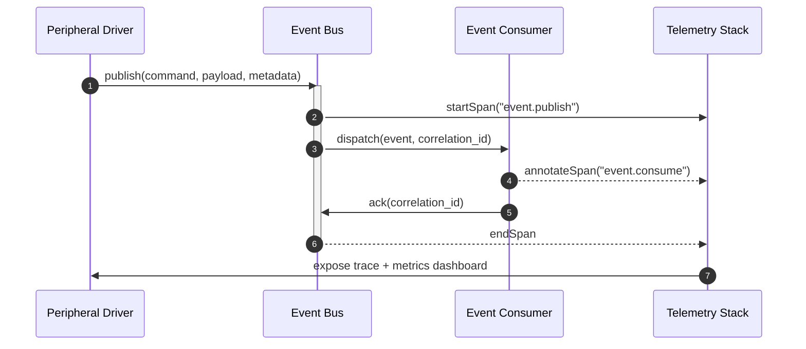

# Problem Statement

The current debugging workflow for the peripherals subsystem (`src/heart/peripheral/`) and the event bus (`src/heart/events/`) provides limited visibility into timing, payload integrity, and cross-component causality. Developers struggle to correlate device I/O with event propagation, leading to lengthy triage loops and inconsistent fixes. We need an integrated observability plan that shortens diagnostic cycles while scaling to new firmware and driver integrations.

# Materials

- Access to the simulated runtime harness (`src/heart/loop.py`) and hardware abstraction layers under `drivers/`.
- Telemetry ingestion stack: single-binary OpenTelemetry Collector (Alloy distribution), Grafana Loki, Grafana Tempo, and Prometheus with Grafana dashboards served locally via Docker Compose.
- Python 3.11 environment managed through `uv`, with developer dependencies installed via `make setup-dev`.
- Feature flags managed through `src/heart/environment.py` to gate instrumentation.
- Diagramming support using Mermaid in Markdown for sequence flows.

# Opening Abstract

We will deliver a phased observability and debugging workflow tailored to the peripherals and event bus subsystems. The plan instruments driver interactions, event emission, and consumer acknowledgements with consistent metadata, funnels signals into a unified tracing and log stack, and exposes curated debugging surfaces. Our objective is to help developers reason about causality within five minutes of encountering anomalies. The work spans three increments: establishing observability baselines, enriching event semantics, and automating developer feedback loops.

# Recommended Lightweight Observability Stack

| Capability | Component | Rationale |
| --- | --- | --- |
| Tracing + Metrics Ingestion | Grafana Alloy (OpenTelemetry Collector distribution) | Ships as a single static binary with sane defaults. Handles OTLP traces, metrics, and logs from Python instrumentation without requiring Kubernetes. |
| Trace Storage | Grafana Tempo (monolithic mode) | Provides durable, high-quality trace storage using object store or local disk. Works well on a single host and integrates with Grafana out of the box. |
| Log Storage | Grafana Loki (single process) | Lightweight log aggregation with label-based queries. Supports push-based ingestion and correlation IDs without the overhead of Elasticsearch. |
| Metrics Store | Prometheus (tsdb mode) | Mature metrics database with excellent exporter ecosystem. Runs well on a Raspberry Pi 4 or modest NUC while retaining alerting and recording rules. |
| Visualisation | Grafana | Unified UI that fuses Tempo, Loki, and Prometheus data sources. Offers dashboards and Explore views ideal for debugging sessions. |
| Packaging | Docker Compose file under `deploy/observability/docker-compose.yml` | Keeps stack reproducible for hobbyist contributors. Each service uses official images with constrained resource profiles. |

The stack emphasises components that run comfortably on a single development machine (8 GB RAM or less) while preserving OpenTelemetry compatibility and production-grade query tooling. Alloy forwards spans and metrics generated inside the Python runtime, Tempo retains traces for replay workflows, and Loki stores structured driver logs. Grafana fuses the signals, enabling tight feedback loops without bespoke UI work.

# Success Criteria

| Behaviour | Validation Signal | Owner |
| --- | --- | --- |
| Every peripheral interaction emits a trace span that includes device ID, command, latency, and status. | Jaeger traces for `peripheral.execute` contain attributes `heart.device_id`, `heart.payload_type`, and `latency_ms`. | Firmware Integration Team |
| Event bus publishes structured logs with correlation IDs linking producers and consumers. | Loki dashboard shows correlated log entries with shared `correlation_id`. | Runtime Observability Group |
| Replay tooling reproduces bus traffic from recorded spans within 5% timing accuracy. | `scripts/replay_event_bus.py` regression test passes and matches timing tolerance. | Tooling Guild |
| Debugging runbooks describe end-to-end workflows and reduce average triage duration to under 30 minutes. | Post-deployment survey shows median time-to-fix drop by 40% against previous quarter. | Developer Experience Team |

# Task Breakdown Checklists

## Phase 1 — Discovery and Baseline Instrumentation

- [ ] Audit current logging in `src/heart/peripheral/base.py`, `src/heart/events/bus.py`, and related drivers under `drivers/`.
- [ ] Document peripheral command lifecycle in a sequence diagram anchored to `loop.PeripheralScheduler`.
- [ ] Add structured logging adapters using `structlog` in shared utility modules.
- [ ] Implement OpenTelemetry span creation in the event dispatcher with context propagation via `contextvars`.
- [ ] Ship metrics counters and histograms (`peripheral_command_total`, `event_dispatch_latency_seconds`) to Prometheus through the existing metrics exporter (`src/heart/utilities/metrics.py`).

## Phase 2 — Semantic Enrichment and Tooling

- [ ] Introduce correlation ID middleware in the event bus that attaches IDs at publication and passes through acknowledgements.
- [ ] Expand payload schemas in `src/heart/events/messages.py` to include device metadata and timestamps.
- [ ] Build a log enricher that post-processes driver logs before they exit the process, adding trace and correlation identifiers.
- [ ] Update `scripts/replay_event_bus.py` to consume stored spans and reissue events into a sandboxed bus instance.
- [ ] Add developer documentation under `docs/runbooks/peripheral_event_debugging.md` explaining trace interpretation and replay steps.

## Phase 3 — Validation and Developer Experience

- [ ] Create smoke tests under `tests/events/test_tracing.py` ensuring spans exist for each event type.
- [ ] Integrate Jaeger trace snapshots into CI artifacts using `scripts/export_traces.py`.
- [ ] Stand up dashboards in `docs/observability/dashboards.md` illustrating key latencies and error rates.
- [ ] Host feedback sessions with peripheral driver owners to identify remaining blind spots.
- [ ] Refine runbooks with Q&A entries and add checklists for common incident classes.

# Narrative Walkthrough

We begin by cataloguing existing instrumentation so we know which pathways already emit signals. Discovery work covers `peripheral.base` command execution, scheduler interactions in `loop.py`, and the event dispatch logic under `events.bus`. The audit informs the first instrumentation pass: we add structured logging and OpenTelemetry spans while ensuring metrics feed into Prometheus. During this phase we introduce sequence diagrams to align contributors on control flow.

With baseline telemetry in place, we invest in semantic enrichment. Correlation IDs thread through bus messages, enabling developers to trace a command from invocation through consumption. Schema updates provide consistent metadata, while log enrichment and replay tooling translate raw telemetry into actionable debugging aids. The replay script allows engineers to reproduce anomalies locally, guided by recorded spans.

Finally, we focus on validation and developer experience. Automated tests assert that tracing works as intended, and exported traces become part of CI diagnostics. Dashboards surface latency regressions, while feedback sessions uncover usability issues. Updated runbooks tie the pieces together, ensuring new team members can diagnose issues without tribal knowledge.

# Visual Reference

# Risk Analysis

| Risk | Probability | Impact | Mitigation | Early Signals |
| --- | --- | --- | --- | --- |
| Telemetry introduces unacceptable latency on constrained hardware loops. | Medium | High | Use asynchronous exporters, sampling, and feature flags in `environment.py`. | Increased loop duration metrics beyond 10%. |
| Correlation IDs leak sensitive hardware identifiers into logs. | Low | Medium | Hash identifiers at log time and restrict access to raw spans. | Security review flags new fields. |
| Replay tooling diverges from production event ordering. | Medium | Medium | Use deterministic ordering metadata and validate against production traces weekly. | Replay tests show >5% timing drift. |
| Developers ignore new dashboards due to cognitive overload. | Medium | Medium | Conduct onboarding sessions and embed dashboards into runbooks. | Survey feedback highlights low dashboard usage. |

## Mitigation Checklist

- [ ] Add sampling toggles to the telemetry exporter with validation in `tests/utilities/test_metrics.py`.
- [ ] Run security review on enriched payload schema before deployment.
- [ ] Schedule weekly trace comparison job with alerting on drift thresholds.
- [ ] Include dashboard links in `docs/runbooks/peripheral_event_debugging.md` and team onboarding sessions.

# Outcome Snapshot

Once the plan lands, engineers observe peripheral commands through unified traces, correlated logs, and metrics dashboards. Replays reproduce production issues locally within minutes, while runbooks guide investigations with concrete steps. Feature flags allow instrumentation to scale gradually, and feedback loops keep the observability stack aligned with developer workflows. The peripherals and event bus subsystems become transparent, making regressions and anomalies immediately diagnosable.
