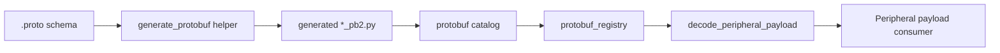

# Protobuf Deep Integration Plan

## Problem Statement

Heart uses protobuf for Beats websocket envelopes and peripheral payloads, but protobuf support remains narrow and ad hoc. The current registry only autoloads packages that are explicitly registered (for example, `src/heart/device/beats/proto/__init__.py`), and there is no unified workflow for declaring schemas, generating Python modules, or wiring payload types into the peripheral event surface. This limits protobuf usage to a few workflows, forces manual imports, and makes it difficult for new peripherals to adopt protobuf without duplicating integration work.

## Materials

- Python runtime with the `protobuf` and `types-protobuf` dependencies (declared in `pyproject.toml`).
- Protobuf compiler (`protoc`) plus a stable path for generated modules (e.g., under `src/heart/**/proto`).
- Existing protobuf assets (`src/heart/device/beats/proto/beats_streaming.proto`, `src/heart/device/beats/proto/beats_streaming_pb2.py`).
- Encoding/decoding helpers in `src/heart/peripheral/core/encoding.py` and the registry in `src/heart/peripheral/core/protobuf_registry.py`.
- Documentation references in `docs/beats-websocket-protobuf.md` and `docs/research/beats_streaming_protobuf.md`.

## Opening Abstract

This plan deepens protobuf integration across Heart by formalizing schema registration, code generation, and payload routing. The goal is to make protobuf a first-class payload format for peripherals and runtime streams, with a shared registry that can be populated via configuration or module entry points. The proposal adds a canonical schema catalog, a repeatable generation workflow, and validation tests so new protobuf payloads can be introduced without bespoke wiring.

## Success Criteria

| Target behaviour | Validation signal | Owner |
| --- | --- | --- |
| New protobuf schemas are discoverable via a shared catalog | `protobuf_registry` resolves payload types without manual imports in unit tests | Runtime maintainer |
| Peripheral payloads can be encoded/decoded with protobuf across multiple device modules | Integration tests cover at least two protobuf payload sources beyond Beats | Peripheral maintainer |
| Schema generation workflow is documented and repeatable | `docs/planning/protobuf_deep_integration.md` references scripts/modules and provides a validated command sequence | Documentation owner |
| Protobuf payload decoding errors are observable | Logs include payload type and module hints from `heart.utilities.logging.get_logger` | Observability owner |

## Task Breakdown Checklists

### Discovery

- [ ] Inventory current protobuf usage across `src/heart/device/beats/` and `src/heart/peripheral/core/`.
- [ ] Identify candidate peripheral payloads that should migrate from JSON to protobuf (reference `heart.peripheral.core.encoding` call sites).
- [ ] Review existing docs (`docs/beats-websocket-protobuf.md`, `docs/research/beats_streaming_protobuf.md`) for schema constraints and client expectations.

### Implementation

- [ ] Define a protobuf schema catalog module (for example `src/heart/peripheral/core/protobuf_catalog.py`) that records package prefixes and module paths, and registers them with `protobuf_registry` at import time.
- [ ] Extend the registry with an explicit registration API for device-specific packages; update `src/heart/device/beats/proto/__init__.py` to use the catalog instead of direct registration.
- [ ] Create a small build helper (for example `scripts/generate_protobuf.py`) that compiles `.proto` files into `*_pb2.py` modules under `src/heart/**/proto`, documenting the command in the catalog module docstring.
- [ ] Update peripheral encoding helpers to accept payload type aliases or enums to reduce stringly-typed usage in `heart.peripheral.core.encoding`.
- [ ] Add tests under `tests/peripheral/` to verify catalog-driven payload decoding, including a non-Beats protobuf payload.

### Validation

- [ ] Run `make test` to ensure existing protobuf and websocket tests still pass.
- [ ] Add regression tests that verify the registry can resolve types after importing the catalog module.
- [ ] Confirm that log output includes payload type context when decoding fails (use `logger.exception` in error paths).

### Rollout

- [ ] Update docs to call out the shared schema catalog and generation workflow in the protobuf documentation.
- [ ] Communicate the integration pattern to device owners, highlighting how to add schema packages and payload types.

## Narrative Walkthrough

The Discovery phase focuses on understanding which components already depend on protobuf and identifying new candidates. The existing Beats streaming path (`src/heart/device/beats/websocket.py`) and peripheral encoding helpers (`src/heart/peripheral/core/encoding.py`) provide the canonical examples, while the registry (`src/heart/peripheral/core/protobuf_registry.py`) illustrates how payload types are resolved at runtime. Mapping these call sites clarifies where protobuf is already stable and where registration gaps cause brittle imports.

Implementation starts by introducing a shared schema catalog module that lives alongside `protobuf_registry`. This module becomes the single place where package prefixes and generated module paths are listed, allowing new schemas to be added by updating a single file. The catalog should register package prefixes with `protobuf_registry` at import time so that `decode_peripheral_payload` can resolve types even if the caller has not imported the protobuf module. A lightweight generation helper script will provide a repeatable way to compile `.proto` files into `_pb2.py` modules, ensuring that generated code stays colocated with the schema. This approach keeps schema ownership close to the device module while maintaining a single registration surface.

Validation emphasizes regression coverage: tests should confirm that the registry resolves symbols when only the catalog module is imported, and should exercise a second protobuf payload outside the Beats streaming path. This proves the integration is general-purpose and ensures the logging path captures payload type context for debugging. Finally, the rollout phase updates docs to direct contributors to the catalog and generation helper so new protobuf payloads follow the same pattern without reverse-engineering the Beats implementation.

## Visual Reference

## Risk Analysis

| Risk | Probability | Impact | Mitigation | Early warning signal |
| --- | --- | --- | --- | --- |
| Catalog becomes stale and payload types fail to resolve | Medium | High | Enforce tests that import the catalog and decode protobuf payloads | Test failures when resolving payload types outside Beats |
| Generated code drifts from schema definitions | Medium | Medium | Add a documented generation script and include it in contributor guidance | Git diff shows manual edits to `_pb2.py` files |
| Logging becomes noisy when decoding failures spike | Low | Medium | Log at error level with concise payload type context; use `logger.exception` once per failure | Log volume alerts tied to protobuf decode errors |
| Client protobuf decoders fall out of sync | Medium | High | Require schema updates to touch both server and client references | Client decode errors after schema changes |

Mitigation checklist:

- [ ] Add a test that fails if catalog imports are missing.
- [ ] Document the generation workflow to discourage manual edits to `_pb2.py` files.
- [ ] Set logging guidelines for protobuf decode failures to avoid noisy loops.
- [ ] Track client schema updates in a shared checklist during releases.

## Outcome Snapshot

After implementation, protobuf schemas live with device modules but are registered through a single catalog, enabling payload decoding without manual imports. Developers can generate protobuf modules with a documented helper, add new schema packages by editing one catalog file, and rely on tests to validate registry resolution. The peripheral encoding/decoding path supports protobuf payloads as a first-class format, with clear logging and documentation for contributors.
